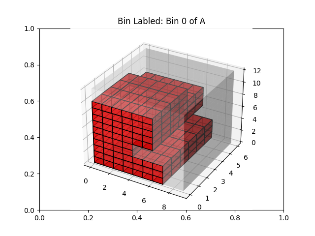
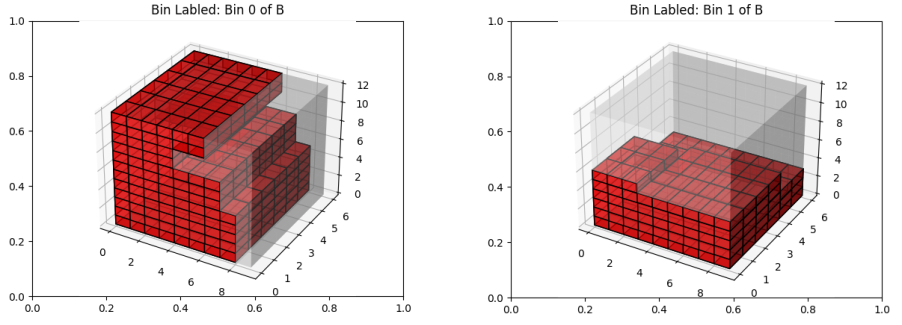
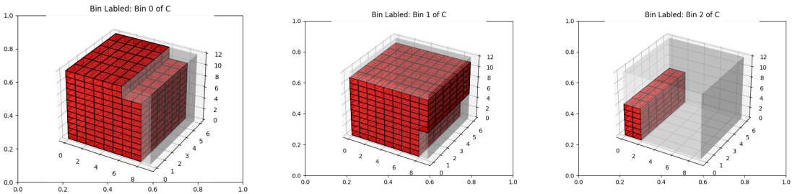

## CSC 490 - Bin Packing
This project evaluated packaging smaller boxes/bins within larger ones. This is typically done with weights in the real world, however this project evaluates volumes instead. The assigned goal was to use the least amount of larger boxes given a specific number of different sized smaller boxes. 

## What I Learned
- This was my first time programming and working in a three dimensional space. I learned that using a coordinate system can be very helpful. 
- I utilized my knowledge of OOP to create objects for each small box and the larger boxes. This helped me better understand how to place each object within a larger object. 
- Visualization is a powerful tool and should be used to better understand concepts and the results of a program. Visual representations can help a developer or user better understand what is going on and can aid in the development and debugging processes. 

## Assigned Scenarios
### Box Sizes
- A: 5" x 4" x 3"
- B: 3" x 3" x 3"
- C: 6" x 2" x 2"

### Item Scenarios
- 10 items: 2 of A, 6 of B, 2 of C
- 20 items: 5 of A, 10 of B, 5 of C
- 30 items: 12 of A, 12 of B, 6 of C

### Packing Container Dimensions
12" x 9" x 6"

## Results
- Scenario A: One large bin fit all ten items.

- Scenario B: Two large bins fit all twenty items

- Scenario C: Three large bins were required to fit all thirty items.

## Issues
1. What kind of algorithm should be used? Best Fit? First Fit?
    - I decided that best fit, especially with larger inputs, would take far too long. Since the opposite of best fit (placing a single small box in a larger box and moving on), I landed on a first fit, with an evaluation of the larger box volume. 
2. How will the three dimensional space be evaluated?
    - I decided on using a coordinate system to better understand the space while programming and with the output. 
3. How will the "used" space be noted?
    - For the smaller boxes that were "placed" inside of a larger box, I noted the coordinates as off limits, and would split the box based on three of the sides, creating "smaller sub sections" within the larger box, that were then still available. 
4. How will the output be visualized?
    - I could have settled with a not so easy to understand terminal output, but I decided to integrate Matplotlib functionality to better understand how the larger boxes were being filled and to what extent. When the task is completed, the images are shown to the user. 
5. Matplotlib Visualization Issue
    - While integrating Matplotlib into the program, I ran into an issue where the visualization would continually fill underneath the when there should be open space. The issue was a the way I was visualizing the item, and just needed to cancel out the "overlap." Needed an XOR instead of an OR. 

| Issue Unresolved | Issue Resolved |
|---------|---------|
| .png) | .png)

## What I Would Do Differntly
- Instead of continually creating smaller and smaller sub sections within a larger box, I would evaluate the subsections, to see if any of them form a prism which could be combined, creating a larger sub section. This could add time to the overall program execution, but if I only evaluated the immediate/touching subsections, it would cut down on the total number that I would need to evaluate. 
- I would color the smaller boxes with distinct colors in the visualization, instead of the same color. I think this would allow a better view of which boxes were placed where. 
- I would output how many smaller boxes were placed within each larger box. I think this, in addition to the colorization would help better understand where the smaller boxes were placed. 
